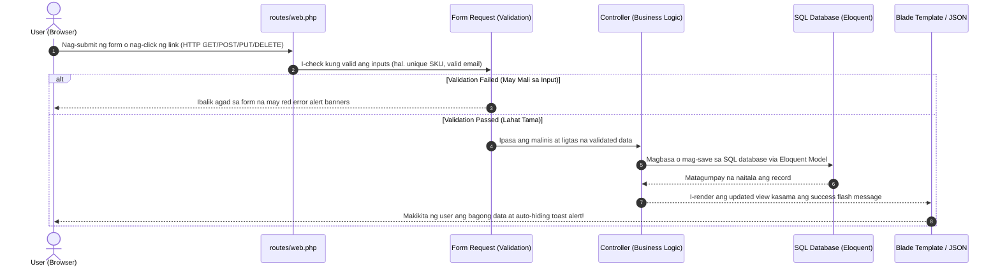
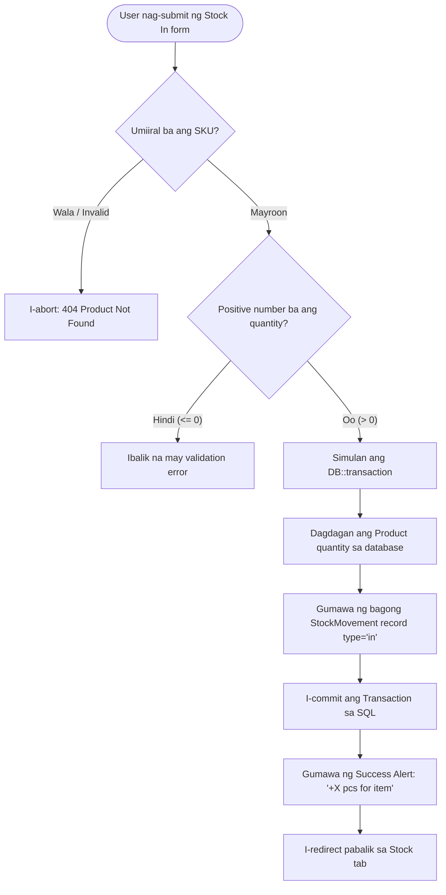
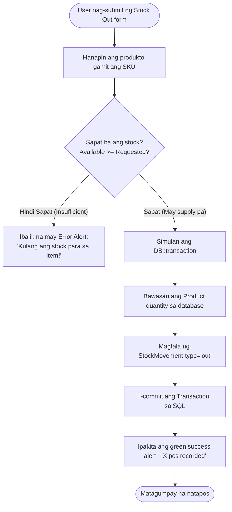
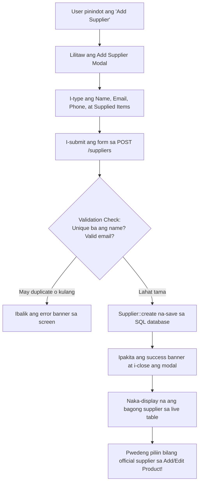
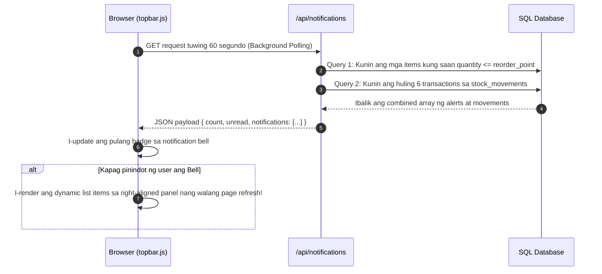

# System Data Flow & Logic Processes (Daloy ng Datos)

Ang dokumentong ito ay nagpapaliwanag sa sunod-sunod na daloy ng impormasyon (logic workflow) sa buong Inventory System. Gumagamit ito ng visual Mermaid diagrams at simpleng Taglish para madaling masundan ng mga nagsisimula pa lamang mag-aral ng web development.

---

## 1. Pangkalahatang Request Lifecycle (Web & API Flow)

Paano naglalakbay ang isang request mula sa browser ng user hanggang sa makabalik ang sagot:



---

## 2. Stock In Flow (Papasok na Stock mula sa Supplier)

Kapag may dumating na bagong delivery o package mula sa supplier:



---

## 3. Stock Out Flow (Pag-dispatch ng Stock na may Safety Check)

Kapag naglabas ng items para sa delivery, sales order, o bawas sa bodega:



---

## 4. Reorder Flow (Kaninong Supplier Bibili?)

Kapag ang stock ng isang produkto ay bumaba sa o pantay sa kanyang safety `reorder_point`, magiging aktibo ang Reorder button:

```mermaid
flowchart TD
    A[Low Stock Item natukoy sa database] --> B[Pinindot ng User ang 'Reorder' button]
    B --> C[Alamin ang dami: max reorder_point * 2 o 20 pcs]
    C --> D{May naka-link bang Official Supplier?}
    D -- May Supplier --> E[Kunin ang pangalan ng Supplier hal. 'Apex Electronics Co.']
    D -- Walang Supplier --> F[Gamitin ang fallback: 'General Warehouse Supplier']
    E --> G[Increment product quantity]
    F --> G
    G --> H[Gumawa ng StockMovement type='in'<br/>notes='Reordered from supplier: [Pangalan]']
    H --> I[I-flash ang success message sa UI:<br/>'Reordered +X pcs for [Item] from supplier: [Pangalan]']
    I --> J[Awtomatikong magre-refresh ang live table at dynamic charts]
```

---

## 5. Supplier Management Flow (Add, Edit, Delete)



---

## 6. Real-time Notifications Aggregation Flow

Paano gumagana ang notification bell sa header bar nang hindi bumibigat ang website:


