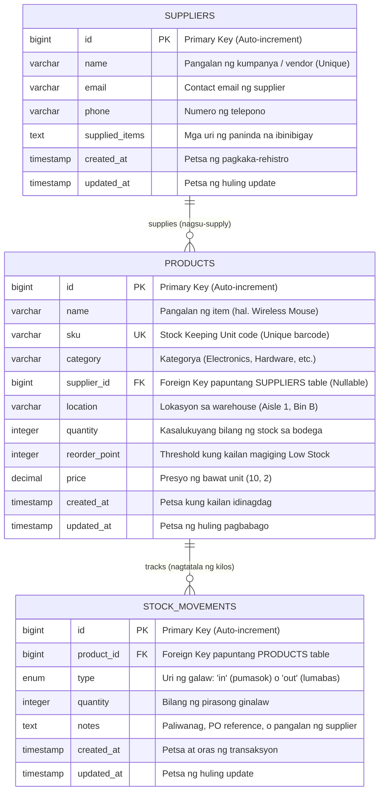

# Database Design & Architecture (Disenyo ng Database)

## 📌 Overview (Pangkalahatang Panimula)
Ang **Inventory System** ay gumagamit ng **Relational SQL Database** (MySQL / MariaDB o SQLite para sa mabilisang development at testing). Hindi ito komplikado: simple, standardized, at sumusunod sa 3rd Normal Form (3NF) upang masigurong walang data redundancy at laging buo ang data integrity.

---

## 📊 Entity Relationship Diagram (ERD)

Ipinapakita ng diagram sa ibaba kung paano konektado ang mga tables sa ating database:



---

## 🗄️ Data Dictionary (Detalyadong Listahan ng mga Tables at Columns)

### 1. `suppliers` Table
Naglalaman ng impormasyon ng mga kumpanya o indibidwal na nagsu-supply ng mga paninda sa bodega.

| Column Name | Data Type | Modifiers | Deskripsyon (Taglish Explanation) |
|---|---|---|---|
| `id` | `BIGINT UNSIGNED` | Primary Key, Auto-increment | Unique identifier para sa bawat supplier. |
| `name` | `VARCHAR(255)` | Not Null, Unique | Opisyal na pangalan ng vendor (bawal ang duplicate). |
| `email` | `VARCHAR(255)` | Not Null | Email address para sa purchase orders at inquiries. |
| `phone` | `VARCHAR(50)` | Not Null | Contact number para sa mabilisang tawag o follow-up. |
| `supplied_items` | `VARCHAR(500)` | Not Null | Listahan ng mga produkto o kategoryang kanilang ibinibenta. |
| `created_at` | `TIMESTAMP` | Nullable | Oras kung kailan nairehistro ang supplier. |
| `updated_at` | `TIMESTAMP` | Nullable | Oras ng huling pag-edit sa detalye ng supplier. |

### 2. `products` Table
Ang master catalog ng lahat ng mga paninda na hawak o ibinebenta ng warehouse.

| Column Name | Data Type | Modifiers | Deskripsyon (Taglish Explanation) |
|---|---|---|---|
| `id` | `BIGINT UNSIGNED` | Primary Key, Auto-increment | Unique identifier ng bawat produkto. |
| `name` | `VARCHAR(255)` | Not Null | Pangalan ng item (hal. "Mechanical Keyboard RGB"). |
| `sku` | `VARCHAR(50)` | Not Null, Unique | Barcode / SKU code (bawal magkapareho ang dalawang item). |
| `category` | `VARCHAR(100)` | Not Null | Grupo o kategorya (hal. "Electronics", "Accessories"). |
| `supplier_id` | `BIGINT UNSIGNED` | Nullable, Foreign Key | ID ng supplier na nagbibigay ng item na ito (`ON DELETE SET NULL`). |
| `location` | `VARCHAR(100)` | Nullable | Pwesto sa bodega (hal. "Aisle 2, Bin C") para madaling mahanap. |
| `quantity` | `INTEGER` | Not Null, Default: 0 | Kasalukuyang bilang ng stock na pwedeng ibenta o i-dispatch. |
| `reorder_point` | `INTEGER` | Not Null, Default: 10 | Kapag ang `quantity <= reorder_point`, magiging "Low Stock" ito. |
| `price` | `DECIMAL(10,2)` | Not Null, Default: 0.00 | Presyo ng produkto bawat piraso. |
| `created_at` | `TIMESTAMP` | Nullable | Petsa ng pagpasok ng item sa catalog. |
| `updated_at` | `TIMESTAMP` | Nullable | Petsa ng huling pagbabago sa item. |

### 3. `stock_movements` Table
Ang ledger o audit trail. Bawat kilos ng stock (Stock In, Stock Out, Reorder) ay may permanenteng talaan dito.

| Column Name | Data Type | Modifiers | Deskripsyon (Taglish Explanation) |
|---|---|---|---|
| `id` | `BIGINT UNSIGNED` | Primary Key, Auto-increment | Unique transaction ID. |
| `product_id` | `BIGINT UNSIGNED` | Not Null, Foreign Key | Naka-link sa `products.id` (`ON DELETE CASCADE`). |
| `type` | `VARCHAR(10)` | Not Null (`in` / `out`) | `'in'` kapag nagdagdag ng stock; `'out'` kapag nagbawas ng stock. |
| `quantity` | `INTEGER` | Not Null | Dami ng pirasong nadagdag o nabawas. |
| `notes` | `TEXT` | Nullable | Deskripsyon o PO number (hal. "Reordered from supplier: Apex Electronics"). |
| `created_at` | `TIMESTAMP` | Nullable | Eksaktong oras kung kailan naganap ang movement. |
| `updated_at` | `TIMESTAMP` | Nullable | Oras ng huling update. |

---

## 🔍 Karaniwang SQL Queries (Standard SQL Cheat Sheet)

Para sa mga nag-aaral ng SQL, ito ang mga katumbas na tunay na SQL queries na pinapatakbo ng Laravel Eloquent sa likod:

### 1. Kunin ang lahat ng Low Stock Products kasama ang kanilang Supplier:
```sql
SELECT 
    p.id,
    p.name AS product_name,
    p.sku,
    p.quantity,
    p.reorder_point,
    s.name AS supplier_name,
    s.phone AS supplier_phone
FROM products p
LEFT JOIN suppliers s ON p.supplier_id = s.id
WHERE p.quantity <= p.reorder_point
ORDER BY p.quantity ASC;
```

### 2. Kalkulahin ang Buwanang Stock In at Stock Out (Para sa Reports Chart):
```sql
SELECT 
    strftime('%m', created_at) AS month_number,
    SUM(CASE WHEN type = 'in' THEN quantity ELSE 0 END) AS total_stock_in,
    SUM(CASE WHEN type = 'out' THEN quantity ELSE 0 END) AS total_stock_out
FROM stock_movements
WHERE strftime('%Y', created_at) = '2026'
GROUP BY month_number
ORDER BY month_number ASC;
```

### 3. I-record ang Stock Out (Bawas sa Inventory na may Transaction):
```sql
BEGIN TRANSACTION;
UPDATE products 
SET quantity = quantity - 15, updated_at = CURRENT_TIMESTAMP
WHERE id = 1 AND quantity >= 15;

INSERT INTO stock_movements (product_id, type, quantity, notes, created_at, updated_at)
VALUES (1, 'out', 15, 'Sales Order #1042', CURRENT_TIMESTAMP, CURRENT_TIMESTAMP);
COMMIT;
```

---

## 💡 Paano Lumipat sa Pagitan ng SQLite at MySQL (Storage Options)

Ang application ay ginawa para gumana nang walang aberya sa dalawang sikat na SQL databases:

1. **SQLite (Default / Local / Fast)**:
   - File-based database (`database/database.sqlite`).
   - Hindi nangangailangan ng hiwalay na MySQL daemon server.
   - Paborito para sa testing at mabilisang pagsisimula.
2. **MySQL / MariaDB Server**:
   - Standard relational database server (default port `3306`).
   - I-configure sa `.env`:
     ```env
     DB_CONNECTION=mysql
     DB_HOST=127.0.0.1
     DB_PORT=3306
     DB_DATABASE=inventory_system
     DB_USERNAME=root
     DB_PASSWORD=
     ```
   - Pagkatapos, patakbuhin: `php artisan migrate --seed`.
